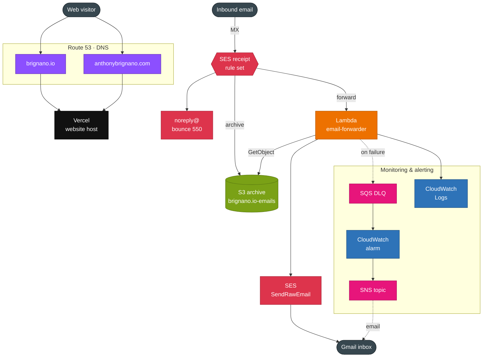
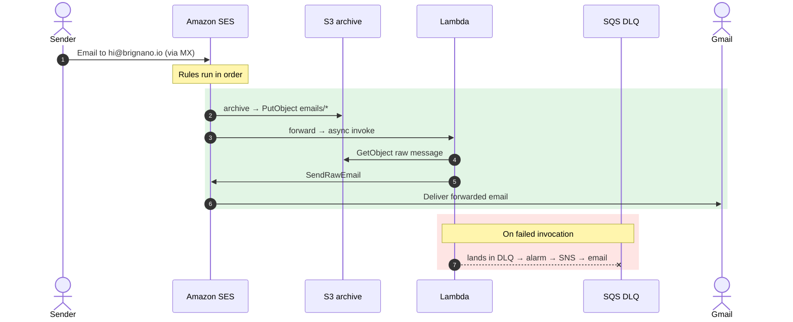
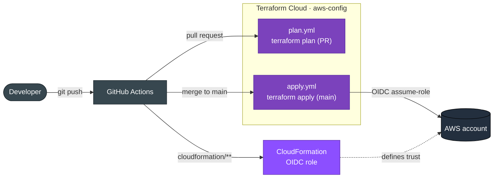

# Architecture

Canonical reference for the AWS infrastructure provisioned by Terraform in
[`iac/`](../iac), managed through the Terraform Cloud workspace
[`brignano/aws-config`](https://app.terraform.io/app/brignano/workspaces/aws-config).
Everything runs in **`us-east-1`**.

For the *why* behind these choices, see [design.md](design.md).

## System diagram

Colors follow AWS's own service-category palette:

| Color | Service | AWS category |
|-------|---------|--------------|
| 🟪 Purple | Route 53 | Networking & Content Delivery |
| 🟥 Red | SES | Customer Engagement |
| 🟩 Green | S3 | Storage |
| 🟧 Orange | Lambda | Compute |
| 🩷 Magenta | SQS / SNS | Application Integration |
| 🟦 Blue | CloudWatch | Management & Governance |

## Email forwarding flow

> Mail to `noreply@brignano.io` is bounced (SMTP 550 / 5.1.1) before any of the
> above and never reaches S3 or Lambda.

## Resource inventory

Every resource lives in [`iac/main.tf`](../iac/main.tf) unless noted. Values come
from [`iac/locals.tf`](../iac/locals.tf).

| Domain | Terraform resource | Purpose |
|--------|--------------------|---------|
| **DNS** | `aws_route53_zone.default` | Hosted zone `brignano.io` (`prevent_destroy`) |
| | `aws_route53_zone.backup` | Hosted zone `anthonybrignano.com` (`prevent_destroy`) |
| | `aws_route53_record.default` / `default_www` | Apex A → Vercel IP, `www` alias → apex |
| | `aws_route53_record.backup` / `backup_www` | Apex A → Vercel IP, `www` CNAME → Vercel |
| | `aws_route53_record.google_search_console` | TXT for Google Search Console verification |
| | `aws_route53_record.ses_verif` | TXT `_amazonses` for SES domain verification |
| | `aws_route53_record.email` | MX → `inbound-smtp.us-east-1.amazonaws.com` |
| **Email (SES)** | `aws_ses_domain_identity.primary` (+ `_verification`) | Verified sending/receiving identity for `brignano.io` |
| | `aws_ses_email_identity.email` | Verified forwarding destination (Gmail) |
| | `aws_ses_receipt_rule_set.primary` (+ `aws_ses_active_receipt_rule_set`) | Active rule set `default-rule-set` |
| | `aws_ses_receipt_rule.noreply` | Bounce `noreply@` |
| | `aws_ses_receipt_rule.archive` | Store `hi@` mail to S3 under `emails/` |
| | `aws_ses_receipt_rule.forward` | Invoke Lambda for `hi@` |
| **Storage (S3)** | `aws_s3_bucket.email` | `brignano.io-emails` |
| | `aws_s3_bucket_server_side_encryption_configuration.email` | AES256 at rest |
| | `aws_s3_bucket_versioning.email` | Versioning enabled |
| | `aws_s3_bucket_acl` / `_ownership_controls` | Private, `BucketOwnerPreferred` |
| | `aws_s3_bucket_policy.email` | Allow only `ses.amazonaws.com` `PutObject` (account-scoped) |
| **Compute** | `aws_lambda_function.email` | `email-forwarder`, python3.12, 30s, DLQ-wired; code in [`iac/lambda/forward_email.py`](../iac/lambda/forward_email.py) |
| | `aws_lambda_permission.email` | Allow SES to invoke the function |
| **IAM** | `aws_iam_role.email` | `LambdaAssumeRole` execution role |
| | `aws_iam_policy.lambda_logs` | Write CloudWatch logs |
| | `aws_iam_policy.s3_get_object` | Read `emails/*` from the bucket |
| | `aws_iam_policy.send_raw_email` | `ses:SendRawEmail` |
| | `aws_iam_policy.sqs_send_message` | `sqs:SendMessage` to the DLQ |
| **Monitoring** | `aws_sqs_queue.email_dlq` | Dead-letter queue, 14-day retention |
| | `aws_sns_topic.email_alerts` (+ `_subscription`) | Email alerts to owner |
| | `aws_cloudwatch_metric_alarm.email_dlq_depth` | Fires when DLQ depth > 0 |
| | `aws_cloudwatch_log_group.email_logs` | Lambda logs, 30-day retention |

## Authentication & delivery pipeline

This Terraform does **not** provision its own auth — the workspace assumes an
IAM role created out-of-band by the CloudFormation stack in
[`cloudformation/`](../cloudformation) via OIDC. Changes flow:

See [`cloudformation/README.md`](../cloudformation/README.md) for the OIDC trust
setup and [`iac/README.md`](../iac/README.md) for deploy/operations detail.
