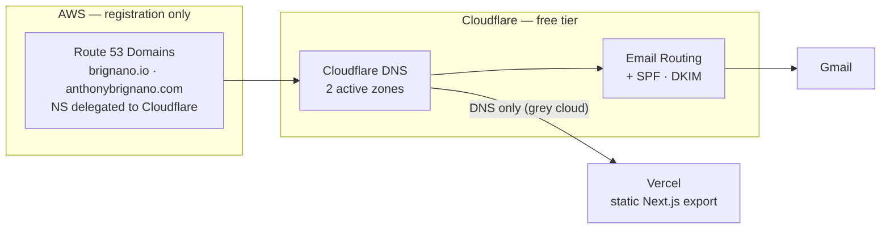
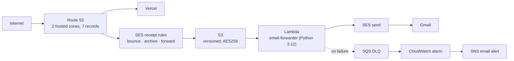

# Architecture

> **Historical.** As of 2026-08-23 this repository manages no AWS resources.
> This page records what the architecture was, and what replaced it. The
> migration itself is documented in
> [tsd-domain-migration-cloudflare.md](tsd-domain-migration-cloudflare.md).

## Current state

```mermaid
graph LR
  subgraph aws["AWS — registration only"]
    R["Route 53 Domains<br/>brignano.io · anthonybrignano.com<br/>NS delegated to Cloudflare"]
  end
  subgraph cf["Cloudflare — free tier"]
    DNS["Cloudflare DNS<br/>2 active zones"]
    ER["Email Routing<br/>+ SPF · DKIM"]
  end
  V["Vercel<br/>static Next.js export"]
  G["Gmail"]

  R --> DNS
  DNS -->|"DNS only (grey cloud)"| V
  DNS --> ER --> G
```

Nothing in this repository provisions any of the above. Cloudflare configuration
is managed through its dashboard; Vercel hosting is unchanged and managed in the
`brignano.io` repository.

**Nameservers:** `itzel.ns.cloudflare.com`, `ricardo.ns.cloudflare.com` (the Free
plan assigns two per zone, and both zones happen to share the same pair).

**Mail exchangers:** `route1/2/3.mx.cloudflare.net` at priorities 4 / 63 / 93.

## Routing rules

| Pattern | Action |
|---|---|
| `hi@brignano.io` | Forward to Gmail |
| `noreply@brignano.io` | Drop |
| catch-all | Drop |

Catch-all is Drop by design. Forwarding it delivers every dictionary attack on
`info@` / `admin@` / `sales@` straight to the destination inbox.

Sub-addressing works without extra configuration — `hi+anything@brignano.io`
falls back to the `hi@` rule.

## What this replaced

```mermaid
graph LR
  I["Internet"] --> R53["Route 53<br/>2 hosted zones, 7 records"]
  R53 --> V["Vercel"]
  R53 --> SES["SES receipt rules<br/>bounce · archive · forward"]
  SES --> S3["S3<br/>versioned, AES256"]
  S3 --> L["Lambda<br/>email-forwarder (Python 3.12)"]
  L --> SES2["SES send"] --> G["Gmail"]
  L -.->|on failure| DLQ["SQS DLQ"] --> CW["CloudWatch alarm"] --> SNS["SNS email alert"]
```

39 Terraform-managed resources in total, all destroyed on 2026-08-23.

### Why it was replaced

The forwarder **re-sent** each message via SES rather than relaying it. That
single design choice caused every one of its documented limitations: HTML
stripped, attachments timing out, CC/BCC dropped, Reply-To lost, and the `From:`
header rewritten to `noreply@brignano.io` — which made sender-based filtering in
Gmail impossible, since every forwarded message appeared to come from the same
address.

It had also been **silently delivering nothing since approximately May 2024**.
Mail was accepted at the MX and dropped. The DLQ, CloudWatch alarm, and SNS
subscription that existed to catch exactly this never fired, which suggests the
failure occurred before Lambda was ever invoked — most likely a deactivated SES
receipt rule set. Terraform declared `aws_ses_active_receipt_rule_set`, so any
apply would have repaired it, but `apply` only runs on changes under `iac/**` and
nothing changed for 18 months. The drift could not self-heal and nothing alerted.

The root cause was never confirmed. Diagnosis was deliberately skipped in favour
of replacing the stack.
