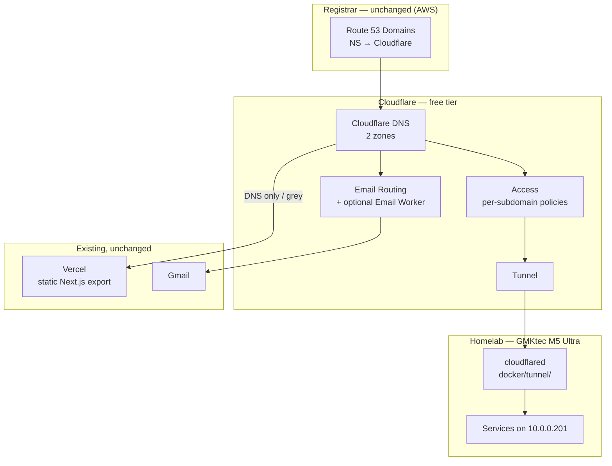

# TSD: Domain migration — AWS Route 53 → Cloudflare

**Status:** Draft, awaiting approval
**Author:** Anthony Brignano
**Created:** 2026-08-18
**Target execution:** 2026-08-23 (Phase 1)
**Repos touched:** `brignano/aws` (Terraform, this repo), `brignano/homelab` (tunnel), `brignano/brignano.io` (none — no code change)

---

## Problem

`brignano.io` and `anthonybrignano.com` have DNS served by AWS Route 53. That was fine
when the only consumers were a Vercel-hosted static site and SES email forwarding.

It stopped being fine when the homelab came online. The lab (GMKtec M5 Ultra, LXC at
`10.0.0.201`) currently reaches the outside world only via Tailscale — every service is
tailnet- or LAN-only. Sharing anything with a friend means adding them to the tailnet,
which is a non-starter for casual access.

The unlock is Cloudflare Tunnel + Cloudflare Access: publicly-resolvable subdomains,
no inbound ports, SSO in front of each one, per-person grants. `homelab/docker/tunnel/`
already contains a working `cloudflared` compose file — it has been sitting undeployed
because **the domain is not on Cloudflare**. This TSD closes that gap.

Secondary motivation: the AWS email stack (SES → S3 → Lambda → SES → Gmail) carries four
documented limitations (HTML stripped, attachments time out, CC/BCC dropped, Reply-To lost)
and ~350 lines of Terraform. Cloudflare Email Routing fixes all four and deletes the stack.

---

## Goals / Non-goals

### Goals
- Cloudflare is authoritative DNS for both zones
- **Zero downtime and zero lost email** — every phase independently revertible
- Public homelab subdomains behind Cloudflare Access, tunnel-only, no port forwarding
- Inbound mail to `hi@brignano.io` keeps arriving in Gmail, with better fidelity than today
- Net reduction in infrastructure: delete SES/Lambda/S3/SQS/SNS/CloudWatch stack
- `$0/mo` on the Cloudflare side

### Non-goals
- **Registrar transfer.** Deferred (see Cost & maintenance). Domains stay at AWS.
- **Moving the website off Vercel.** No change. Vercel records stay DNS-only (grey-cloud).
- **SMS-based authentication.** Cloudflare Access does not support it — see Phase 4.
- **Proxying the Vercel site through Cloudflare.** Explicitly avoided; breaks cert issuance.
- Choosing which homelab services get exposed. Separate decision, post-migration.

---

## Proposed approach

Move DNS authority only. Leave the registrar, leave Vercel, and cut email over as a
**separate, later change** so migration day carries no email risk.

### Why this is structurally safe

Three verified facts make this a low-risk migration rather than a scary one:

```
DS records (DNSSEC):   none on either domain
CAA records:           none on either domain
NS TTL at parent:      172800 (48h)
```

1. **No DNSSEC.** The classic way to black-hole a domain during a nameserver move is to
   flip NS while a DS record still points at the old signer. That risk does not exist here.
2. **No CAA.** Nothing blocks certificate issuance at any point.
3. **A Cloudflare zone has no effect on the world until NS is flipped.** The entire zone
   can be built and verified against Cloudflare's nameservers directly, with the live
   domain completely unaffected.
4. **The Route 53 zone is not deleted at flip time.** Through the 48h overlap window both
   authorities serve byte-identical answers, so no resolver can receive a wrong answer.

### Current state

Verified live via `dig` and `whois` on 2026-08-18.

| Zone | Records | Registrar |
|---|---|---|
| `brignano.io` | 5 | Gandi SAS (via Route 53 Domains reseller) |
| `anthonybrignano.com` | 2 | Amazon Registrar, Inc. |

### Record inventory and Cloudflare mapping

**`brignano.io`**

| Name | Type | Value | Cloudflare | Proxy | Phase |
|---|---|---|---|---|---|
| `@` | A | `216.198.79.1` | A, same value | **DNS only** | 1 |
| `@` | TXT | `google-site-verification=iuAjGvkyDsbBSwLyidTghmiUG6OLTgOGxghW4M317QM` | TXT, same | n/a | 1 |
| `www` | A (R53 **ALIAS** → apex) | — | **A → `216.198.79.1`** | **DNS only** | 1 |
| `_amazonses` | TXT | SES verification token | TXT, same | n/a | 1, removed in 3 |
| `@` | MX | `10 inbound-smtp.us-east-1.amazonaws.com` | Same in P1, → Email Routing MX in P2 | n/a | 1 → 2 |

**`anthonybrignano.com`**

| Name | Type | Value | Cloudflare | Proxy | Phase |
|---|---|---|---|---|---|
| `@` | A | `216.198.79.1` | A, same value | **DNS only** | 1 |
| `www` | CNAME | `7db213ad1eff704d.vercel-dns-017.com` | CNAME, same | **DNS only** | 1 |

> **Trap:** `www.brignano.io` is a Route 53 **ALIAS**, a proprietary pseudo-record with no
> Cloudflare equivalent and no representation in a standard zone-file export. A naive
> import silently drops it and `www.brignano.io` goes dark. It must be hand-created as a
> plain `A` record to the Vercel IP.

### Target architecture



### Email: what actually changes

Cloudflare Email Routing is a strict superset of the current SES receipt rules for this
use case.

| Current SES rule | Cloudflare equivalent |
|---|---|
| `noreply@` → bounce | Rule action **Drop**, or Email Worker `setReject()` (a true SMTP rejection) |
| `archive` → S3 bucket | **Dropped.** See rationale below |
| `forward` → Lambda → SES → Gmail | Rule action **Send to an email**, or **Send to a Worker** (`forward()` / `reply()` / `setReject()`) |

Limits: 200 routing rules per domain, 200 verified destinations per account, 25 MiB max
inbound message. Catch-all and plus-addressing (`hi+jobs@brignano.io`) come free.

**On dropping the S3 archive.** The archive existed as insurance against the forwarder
mangling mail — a real concern, because the Lambda *re-sends* the message via SES, which is
exactly why HTML, attachments, CC/BCC and Reply-To are lost today. Email Routing forwards
the **raw message** with ARC sealing and SRS envelope rewriting, so all four limitations
disappear and Gmail becomes the archive. It additionally runs SPF/DKIM/DMARC validation and
RBL checks on inbound — spam filtering the current stack does not have. If belt-and-braces
is wanted later, an Email Worker can `forward()` to a second destination.

### Alternatives considered

- **Registrar transfer to Cloudflare, now** — rejected: triggers a 60-day ICANN lock during
  the exact window we want flexibility, for a few dollars a year. Also unconfirmed whether
  Cloudflare Registrar accepts `.io`.
- **Move the site to Cloudflare Pages/Workers** — rejected: the static export would drop in
  trivially, but `vercel.json`'s header/CSP config would need rewriting as `_headers` for
  zero functional gain.
- **Orange-cloud (proxy) the Vercel records** — rejected: breaks Vercel's ACME cert
  issuance and layers two CDNs for no benefit.
- **Keep SES, use Cloudflare only for DNS + Access** — viable and lower-effort, but leaves
  ~350 lines of Terraform and four known email defects in place to maintain forever.
- **Big-bang cutover (NS + MX together)** — rejected: during the 48h overlap, senders
  resolving via Route 53 and via Cloudflare would hit different MX hosts. Recoverable only
  if SES stays alive, at which point the phased plan is strictly better and simpler to reason about.

---

## Implementation plan

### Phase 0 — Pre-flight (day of, ~15 min) · **reversible**

1. **Confirm nothing is queued to merge into `iac/**`.** `.github/workflows/apply.yml` runs
   `terraform apply` with auto-approve on pushes to `main` touching `iac/**` or the workflow
   itself. Verified 2026-08-23: no Dependabot config, no open PRs touching `iac/`, and
   nothing self-merges. An apply of the *unchanged* config is a no-op against Route 53, so
   this is near-zero risk in practice — locking the TFC workspace is optional belt-and-braces,
   not a prerequisite. The risk becomes real only at Phase 3, where the mitigation is reading
   the plan output rather than locking.
2. Create the Cloudflare account / confirm the Zero Trust team domain name.
3. Snapshot both zones for rollback reference:
   ```bash
   aws route53 list-resource-record-sets --hosted-zone-id <ZONE_ID> > r53-backup-<zone>.json
   ```
4. Send a test email to `hi@brignano.io`, confirm arrival in Gmail. This is the baseline.

### Phase 1 — DNS authority (day of, ~30 min active + 48h wait) · **reversible**

1. Add both zones to Cloudflare (full setup). **Do not flip NS yet.**
2. Hand-enter all 7 records per the mapping table. Set every record to **DNS only**.
   Keep the SES `MX` and `_amazonses` `TXT` exactly as they are — email does not move today.
3. Verify against Cloudflare's nameservers *before* the flip, while the live domain is
   still fully on Route 53:
   ```bash
   dig @<assigned-cf-ns> brignano.io A +short
   dig @<assigned-cf-ns> www.brignano.io A +short
   dig @<assigned-cf-ns> brignano.io MX +short
   dig @<assigned-cf-ns> brignano.io TXT +short
   dig @<assigned-cf-ns> anthonybrignano.com A +short
   dig @<assigned-cf-ns> www.anthonybrignano.com CNAME +short
   ```
   Every answer must match the current live answer. Do not proceed on any mismatch.
4. Update nameservers at Route 53 Domains for both domains.
5. **Leave the Route 53 hosted zones running.** They are the rollback path.
6. Wait out the 48h NS TTL. Spot-check from a few public resolvers (`@1.1.1.1`, `@8.8.8.8`,
   `@9.9.9.9`) until all report Cloudflare NS.

**Rollback:** revert nameservers at the registrar. Route 53 never stopped serving.

### Phase 2 — Email cutover (T+48h, ~20 min) · **reversible**

1. Enable Email Routing on `brignano.io`; verify `anthonybrignano@gmail.com` as destination.
2. Create rules: `hi@` → forward to Gmail; `noreply@` → **Drop**.
3. **Set catch-all to Drop, not forward.** Catch-all forwarding delivers every dictionary
   attack on `info@` / `admin@` / `sales@` straight to Gmail. Explicit rules only.
4. Let Cloudflare replace the MX records (this removes the SES MX).
5. **Test immediately** — send from an unrelated account, confirm arrival, confirm an HTML
   message with an attachment survives intact (the thing SES could not do).
6. Set up Gmail filters (see *Gmail-side organisation* below).
7. Soak for ~3 days before Phase 3. SES stays deployed and can be restored by reverting MX.

**Rollback:** re-add the SES MX record. SES infrastructure is still live and untouched.

#### Gmail-side organisation

Newly possible: SES *re-sent* messages, destroying the original `To:` header, so
`to:hi@brignano.io` matched nothing. Email Routing forwards the raw message, so header-based
filtering works.

Use **plus-addressing as the categorisation key** — sub-addressed recipients fall back to the
base `hi@` rule automatically, so `hi+github@brignano.io` needs no extra Cloudflare config.
Hand out a distinct alias per service; a leaked alias identifies its leaker and can be killed
with one Drop rule.

| Gmail filter | Action |
|---|---|
| `to:hi@brignano.io` | Label `brignano.io`, **Never send to Spam** |
| `to:hi+newsletters@brignano.io` | Label `brignano.io/newsletters`, Skip Inbox, Mark read |
| `to:hi+recruiters@brignano.io` | Label `brignano.io/recruiters`, Skip Inbox |
| `to:hi+github@brignano.io` | Label `brignano.io/github`, Skip Inbox |

Nested labels collapse to one sidebar group. **"Never send to Spam" is the important one** —
forwarded mail often lands in spam for the first few days while Gmail learns the new path,
and that filter is the insurance against silently losing mail during the Phase 2 soak. It is
only safe *because* catch-all is Drop; with catch-all forwarding it would whitelist spam.

> Verify rather than trust: Gmail's `to:` operator matching against plus-addressed external
> domains is normally literal, but confirm with a real send before relying on the sub-filters.
> The base `to:hi@brignano.io` filter is the one that definitely works.

### Phase 3 — AWS teardown (T+5 days, ~30 min) · **ONE-WAY DOOR**

Do not start until Phase 2 has soaked and email is confirmed healthy.

1. **This is where auto-apply matters.** Merging this PR triggers `terraform apply` with
   auto-approve and no further gate. Read the `plan.yml` output on the PR line by line and
   confirm it destroys only the intended resources before merging.
2. In `brignano/aws`, remove from `iac/main.tf`: both `aws_route53_zone` blocks (delete the
   `prevent_destroy` lifecycle blocks first, or Terraform refuses), all `aws_route53_record`
   blocks, the SES identity/rule-set/receipt-rule resources, the `email-forwarder` Lambda,
   the S3 email bucket, the SQS DLQ, the SNS topic, the CloudWatch alarm and log group, and
   the associated IAM roles/policies. Also delete `iac/lambda/`.
3. Trim `cloudformation/template.yml` — the Terraform Cloud assume-role policy grants
   Route 53/SES/Lambda/S3 permissions that are no longer needed.
4. Open a PR, review the plan output carefully, merge.
5. Update `readme.md`, `docs/architecture.md`, `docs/design.md` — the architecture diagram
   and cost table are now wrong. Also update `ideas/infrastructure/aws-config/`, which
   mirrors this stack so idea briefs can reason about reuse; it documents the Route 53 +
   SES + Lambda forwarder being deleted here.

> **Decided 2026-08-18: do not export the S3 archive.** Gmail retains every forwarded
> message, so the bucket is redundant. Note the bucket has versioning enabled — emptying it
> requires deleting all object versions. This is unrecoverable.

**Rollback:** none. This is the one-way door. Everything before it is reversible.

### Phase 4 — Access + Tunnel (post-migration, separate session) · **reversible**

Deliberately *not* scoped here. Once Cloudflare is authoritative, revisit as its own TSD.
Captured requirements and findings:

- **Seamless SSO across subdomains** — native. Access issues a session at
  `<team>.cloudflareaccess.com`, so authenticating once covers every subdomain.
- **Configurable session TTL** — native, per-application, from minutes to a month.
  Suggested split: long TTL for friends/family content, short for anything admin-adjacent.
- **Per-person, per-subdomain grants** — native. One Access application per hostname, each
  with its own allow policy.
- **SMS / phone-number authentication — NOT SUPPORTED by Cloudflare Access.** Login methods
  are the Cloudflare IdP, third-party OIDC/SAML, and one-time PIN — and **OTP is email-only**.
  There is no phone-number policy selector.
  - **Recommended v1: email OTP.** Zero cost, zero dependencies, satisfies every other
    requirement above.
  - **If SMS is genuinely required:** a generic OIDC IdP in front of Access that does SMS
    itself. Self-host-consistent option is Authentik on the lab with a Twilio SMS stage.
    Costs: US A2P 10DLC brand registration + monthly campaign fee + per-message, plus a
    **bootstrap dependency** — if the IdP sits behind the tunnel it protects, a tunnel
    outage locks everyone out. Mitigable (expose the IdP hostname with no Access policy,
    keep an email-OTP fallback policy) but disproportionate for a handful of people.
    Phone numbers are also a weaker factor than email given SIM-swap risk.
- `homelab/docker/tunnel/docker-compose.yml` is ready; needs `CLOUDFLARE_TUNNEL_TOKEN`.
- `homelab/AGENTS.md` currently states "don't expose Portainer/Grafana/PostgreSQL via
  Cloudflare Tunnel." Worth revisiting — with a default-deny Access policy the calculus for
  Grafana changes. PostgreSQL should stay off regardless.

---

## Cost & maintenance

### Run cost

| Item | Today | After |
|---|---|---|
| Route 53 hosted zones (2) | $1.00/mo | $0 |
| Route 53 queries | ~$0.40/mo | $0 |
| SES send/receive | ~$0.01/mo | $0 |
| Lambda | $0 (free tier) | $0 |
| S3 (email archive) | ~$0.02/mo | $0 |
| CloudWatch Logs | ~$0.50/mo | $0 |
| Cloudflare DNS / Email Routing / Tunnel / Access | — | **$0** (Access free tier: 50 seats) |
| **Total** | **~$1.93/mo** | **~$0/mo** |

Domain registration is unchanged and billed annually at AWS either way.

### Homelab footprint

`cloudflared` is a single Go binary in a container: **~30–50 MB RAM, <100 MB disk**.
Negligible against 16 GB. It joins the existing `core_core` and `ai_ai` Docker networks,
so no new host port bindings.

### Maintenance burden

Net **reduction**. Deleted: a Python Lambda (runtime upgrades), an S3 lifecycle, a DLQ +
CloudWatch alarm + SNS topic, ~350 lines of Terraform, and the Terraform Cloud ↔ AWS OIDC
plumbing that existed largely to manage them. Added: one `cloudflared` container to keep
updated, plus Access policies that need pruning as people come and go.

### Registrar — deferred decision

Route 53 Domains is adequate but marks up over wholesale and has poor UX; `.io` additionally
routes through Gandi as reseller, which complicates transfers out. Cloudflare Registrar is
at-cost and cheapest — but **it is unconfirmed whether it accepts `.io`**; verify at
`domains.cloudflare.com/tlds`. Porkbun is the usual fallback for `.io`. Revisit in ~3 months
once the 60-day-lock consideration is irrelevant. Savings are single-digit dollars per year.

---

## Risks & open questions

### Risks

| Risk | Severity | Mitigation |
|---|---|---|
| **Silent email loss** during MX cutover | **Highest** — silent and unrecoverable | MX untouched in Phase 1. Phase 2 is isolated and reversible; SES stays live through soak. Test send before and after every phase |
| TFC auto-apply changes DNS unexpectedly | Low — needs a merge touching `iac/**`; none queued, no Dependabot, nothing self-merges, and applying the unchanged config is a no-op | Confirm no pending `iac/` PRs before starting. Real exposure is Phase 3: read the plan output on the PR before merging |
| `www.brignano.io` ALIAS dropped on import | Medium — silent 1-hostname outage | Explicitly hand-created as an A record; verified by `dig` in Phase 1 step 3 |
| Site goes dark on NS flip | Low — no DNSSEC | Route 53 zone stays live for full 48h overlap; pre-flip verification against CF nameservers |
| Vercel cert issuance breaks | Low | All Vercel records **DNS only**, never proxied |
| Google Search Console verification lost | Low | TXT carried in the inventory and verified pre-flip |
| **Homelab becomes publicly reachable** | Medium — new exposure | Default-deny Access policy on every hostname; tunnel-only, no port forwarding; admin UIs stay off the tunnel |
| Homelab data-durability posture | Medium | Review backup/restore coverage before Phase 4. Tracked separately from this migration |

### Open questions

1. ~~**Archive the existing S3 email bucket before teardown?**~~ **Resolved 2026-08-18: no.**
   Gmail retains the forwarded messages; delete the bucket in Phase 3 without exporting.
2. **Add SPF/DKIM/DMARC?** Neither domain has any sender authentication today. Not required
   for Email Routing (receive-only), but if `brignano.io` ever *sends* mail this becomes
   mandatory. Out of scope here; worth its own small follow-up.
3. **Does Cloudflare Registrar accept `.io`?** Unverified. Only blocks the deferred
   registrar decision, not this migration.
4. **Which homelab services get exposed, and to whom?** Phase 4 / separate TSD.
5. **Is email OTP acceptable for friends/family, or is SMS a hard requirement?** Drives
   whether Phase 4 is a 30-minute configuration or a self-hosted-IdP project.

---

## Assumptions made

- Cloudflare account exists or will be created; free plan throughout.
- `hi@brignano.io` is the only inbound address in real use.
- No third-party service currently authenticates against `_amazonses` or sends as
  `@brignano.io` (nothing in either repo suggests otherwise).
- Downtime tolerance is effectively zero, hence the phased design over a faster big-bang.
